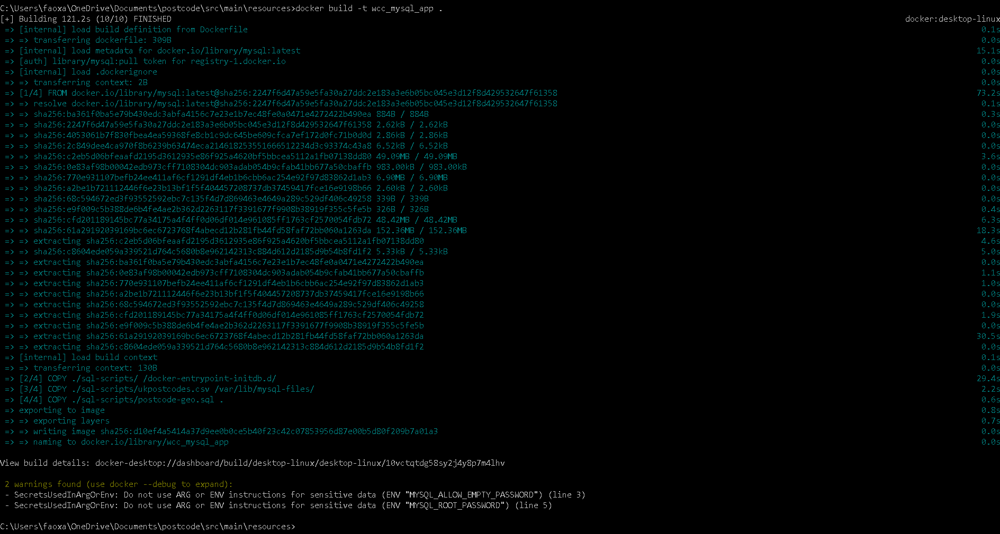
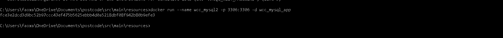
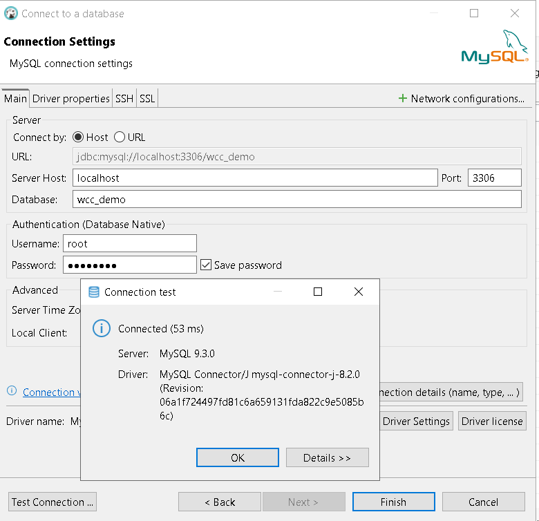
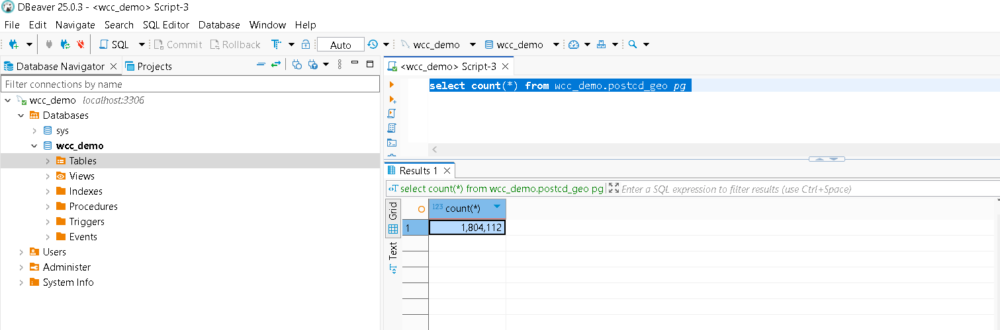

# Getting Started

Calculate the geographic (straight line) distance between two postal codes in the UK.

Display calculation history

Huge records of csv file (ukpostcodes.csv) downloaded from https://www.freemaptools.com/download-uk-postcode-lat-lng.htm

Import data into mySQL database was automated in this assignment

After successful calculate the distance, the calculation result and postcode details will be stored into table.

On subsequent request with same postcodes inputs, result will retrieve from history table, instead of new calculation

### Install Maven
Follow the official Maven installation guide for your operating system:
    https://maven.apache.org/install.html

### Install JDK 24
Follow the official JDK 24 installation guide for your operating system:
    https://www.oracle.com/my/java/technologies/downloads/

### Install Docker
Follow the official Docker installation guide for your operating system:
    Windows: https://docs.docker.com/desktop/install/windows-install/
    macOS: https://docs.docker.com/desktop/install/mac-install/
    Linux: https://docs.docker.com/engine/install/1 (Choose the guide for your specific distribution).

### MYSQL docker install and import ukpostcodes.csv
1) Build custom docker image.
   Run the below command at the same folder of Dockerfile
    `docker build -t wcc_mysql_app .`
    

2) Start MsSQL server image
   The initial script to import csv file will be auto execute
   
   `run --name wcc_mysql2 -p 3306:3306 -d wcc_mysql_app`
   
    

4) Validate the mySQL connection
   Use your favorite tool to test connection
   For my case, I use dBeaver

    `Server host: localhost
     port: 3306
     database: wcc_demo
     username: root
     password: password`

   
   
5) Connect to database validate the table
   

### Springboot application build and run

The below command must be run at the same folder as pom.xml
1) Build the application
   
`mvn clean install`

3) Run
   
`mvn spring-boot:run`

5) Testing API
The API can be test using swagger by go to the below URL.

http://localhost:8081/swagger-ui/index.html
